<div align="center">



<a href="https://github.com/Derekthefato">
  
</a>

<br/>


</div>

---

## 🕹️ &nbsp;SELECT PLAYER

```text
╔══════════════════════════════════════════════════════════╗
║  NOME ........ Derek                                     ║
║  CLASSE ...... Dev Full-Stack / Automação                ║
║  HP .......... ████████████████████ 100%                 ║
║  XP .......... ███████████████░░░░░ nível em ascensão    ║
║  MISSÃO ...... transformar processo manual em sistema    ║
║  INVENTÁRIO .. Node · React · TypeScript · SQL · Bots    ║
╚══════════════════════════════════════════════════════════╝
```

## 🎮 &nbsp;INVENTÁRIO (STACK)

<div align="center">


<br/>


</div>

## 🗺️ &nbsp;FASES DESBLOQUEADAS (PROJETOS)

| Fase | Projeto | O que faz |
| :-: | :-- | :-- |
| 🛡️ | **Sentinela** | Bot de QA automatizado em Node: navega no sistema, testa fluxos e reporta achados. 100% gratuito. |
| 💸 | **Gastos** | Dashboard financeiro pessoal com watcher que lê comprovantes e lança os gastos sozinho. |
| 🚗 | **[AutoTrack](https://github.com/Derekthefato/veiculosmanutencao)** | Controle de veículos e manutenções: histórico, prazos e lembretes. |
| 🧩 | **[Componentes Playground](https://github.com/Derekthefato/componentes-playground)** | Laboratório de componentes de UI em TypeScript. |
| 🌐 | **Sites imersivos** | Sites e páginas de catálogo com animação e identidade própria, do briefing ao deploy. |
| 💊 | **Lembretes por WhatsApp** | Automação que avisa medicamentos no horário certo. |

> 🔒 Alguns projetos são privados ou de clientes, por isso nem todos aparecem na lista de repositórios.

## 📊 &nbsp;PLACAR (STATS)

<div align="center">


</div>

## 🏆 &nbsp;TROFÉUS

<div align="center">


</div>

## 🐍 &nbsp;SNAKE (CONTRIBUIÇÕES)

<div align="center">

<picture>
  <source media="(prefers-color-scheme: dark)" srcset="https://raw.githubusercontent.com/Derekthefato/Derekthefato/output/github-snake-dark.svg" />
  <source media="(prefers-color-scheme: light)" srcset="https://raw.githubusercontent.com/Derekthefato/Derekthefato/output/github-snake.svg" />
  
</picture>

</div>

## 📡 &nbsp;CONTINUE (CONTATO)

<div align="center">

[](https://github.com/Derekthefato)
[](mailto:dedehuehue@gmail.com)

<br/>


`GAME OVER? NÃO. INSERT COIN TO CONTINUE. 🪙`

</div>
